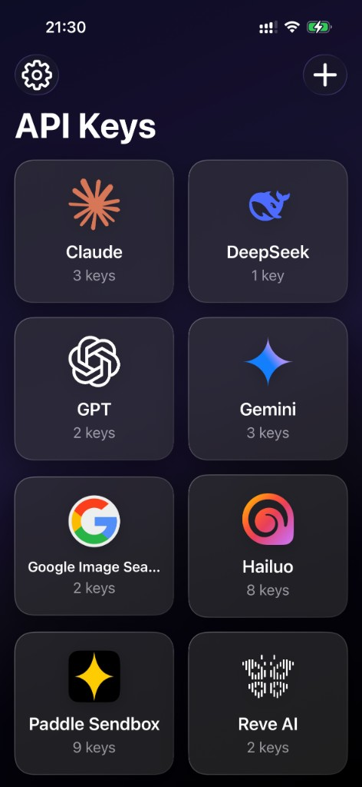
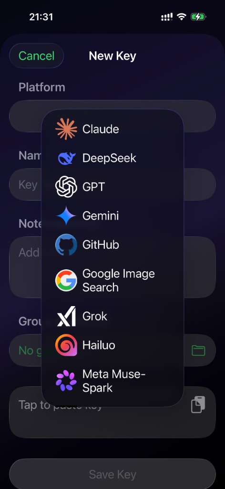
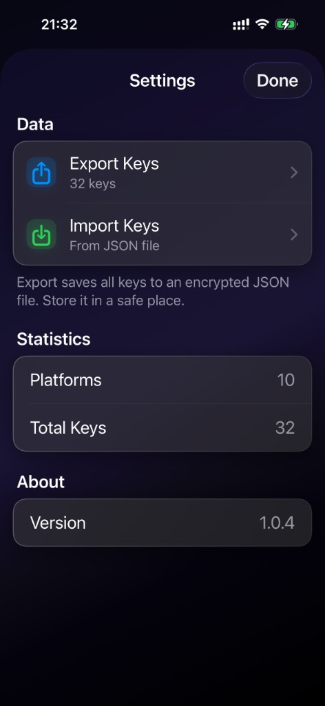
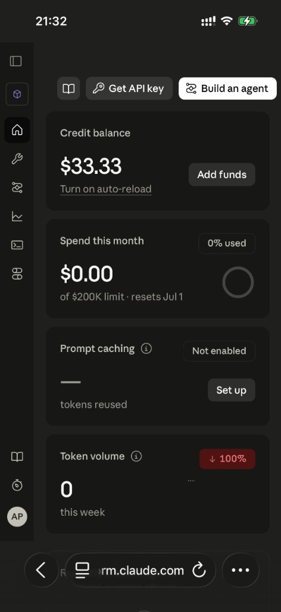

# BYOK Vault — iOS

**Bring Your Own Key** — a secure API key manager for iPhone.

Store API keys for AI and developer services (OpenAI, Anthropic, Gemini, and more) in one place. Secret values live in the **iOS Keychain**; metadata stays in **SwiftData**.

<p align="center">
  
  
  
  
</p>

---

## Features

- **Keychain-backed secrets** — API key values never stored in SwiftData
- **Platform organization** — group keys by provider (built-in or custom)
- **Key groups** — optional folders per platform
- **Custom platforms** — add any service with your own icon (250×250 recommended)
- **One-tap paste** — insert a key from the clipboard when adding
- **Duplicate detection** — blocks saving the same key value twice
- **Notes** — optional description per key
- **Live validation** — optional check against provider APIs (Claude, GPT, Gemini, DeepSeek, Hailuo)
- **Dashboard links** — quick open to provider consoles (built-in URLs + custom)
- **Backup** — export/import vault as encrypted JSON (Settings)
- **Localization** — English and Russian (follows system language)
- **Dark UI only** — fixed dark theme with glass-style surfaces

---

## Built-in platforms

Preset icons and default dashboard URLs:

| Platform | Icon | API validation |
|----------|:----:|:----------------:|
| Claude | ✅ | ✅ |
| GPT (OpenAI) | ✅ | ✅ |
| Gemini | ✅ | ✅ |
| DeepSeek | ✅ | ✅ |
| Hailuo (MiniMax) | ✅ | ✅ |
| Grok | ✅ | — |
| Qwen | ✅ | — |
| Meta Muse-Spark | ✅ | — |
| Reve AI | ✅ | — |
| GitHub | ✅ | — |
| Google Image Search | ✅ | — |

You can add any other platform with a custom name and icon. Platform **names** are not translated (e.g. `Claude`, `GPT` stay as-is).

---

## Architecture

```
KeyVault/
├── Models/
│   ├── APIKey.swift          # SwiftData key metadata
│   ├── Platform.swift        # Provider + dashboard URL
│   └── KeyGroup.swift        # Optional groups per platform
├── Views/
│   ├── MainView.swift        # Platform grid
│   ├── PlatformKeysListView.swift
│   ├── KeyDetailView.swift
│   ├── AddKeyView.swift
│   ├── SettingsView.swift    # Export / import / stats
│   ├── DashboardLinkView.swift
│   └── PlatformIconView.swift
├── Services/
│   ├── KeychainService.swift
│   ├── AnthropicService.swift
│   ├── OpenAIService.swift
│   ├── GeminiService.swift
│   ├── DeepSeekService.swift
│   ├── HailuoService.swift
│   └── ImageHelper.swift
├── Design/
│   └── MaterialTheme.swift   # Background, glass surfaces
├── Localizable.xcstrings     # EN (source) + RU
└── Assets.xcassets/          # Platform icons
```

### Security model

Two layers:

1. **SwiftData** — names, platform, notes, validation flag, dates (no secret values)
2. **Keychain** — actual key strings, keyed by per-entry UUID

```swift
@Model
final class APIKey {
    var myName: String
    var keychainID: String    // UUID for Keychain lookup
    var platform: Platform?
    // The secret is never stored in the database.
}
```

Export JSON includes key values — treat backup files as sensitive.

---

## Tech stack

| Area | Technology |
|------|------------|
| Language | Swift 5 |
| UI | SwiftUI (iOS 26) |
| Persistence | SwiftData |
| Secrets | Security / Keychain |
| Localization | String Catalog (`Localizable.xcstrings`) |
| Min deployment | iOS 26.0 |

---

## Getting started

### Requirements

- Xcode 26+
- iOS 26+ device or simulator
- macOS compatible with Xcode 26

### Build and run

```bash
git clone https://github.com/malgana/BYOK-Vault-iOS.git
cd BYOK-Vault-iOS
open KeyVault.xcodeproj
```

Then build and run in Xcode (**⌘R**).

### Configuration

No API keys or environment variables are required to build. Your own keys are entered inside the app after install.

---

## Screenshots

<p align="center">
  
  
  
</p>
<p align="center">
  
  
</p>

*Dashboard link on the platform screen opens the provider console in Safari (example: Claude).*

---

## License

MIT — see [LICENSE](LICENSE).

Copyright (c) 2025 Aleksandr Prostetsov

---

## Author

**Aleksandr Prostetsov**

- GitHub: [@malgana](https://github.com/malgana)
